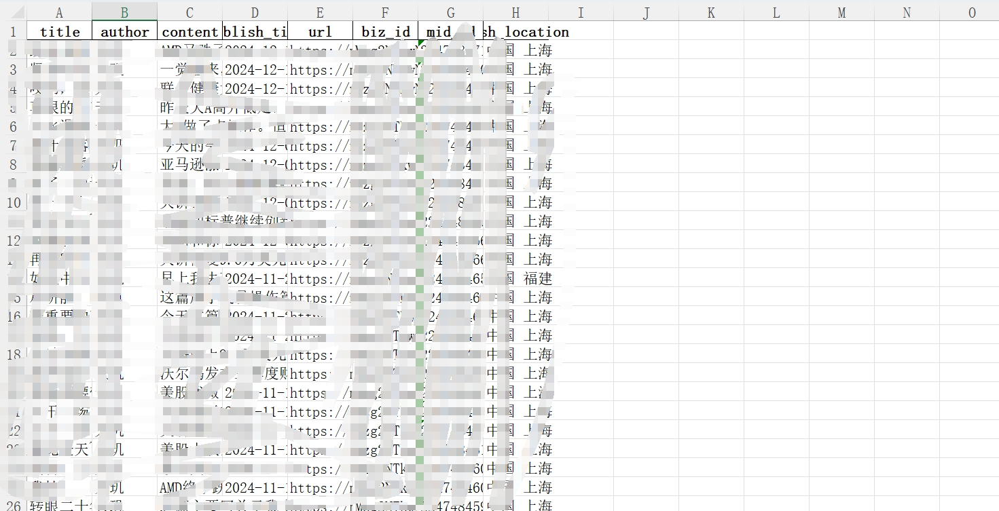
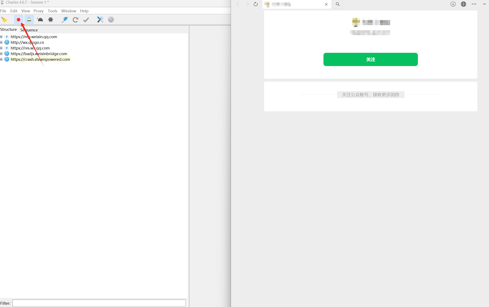
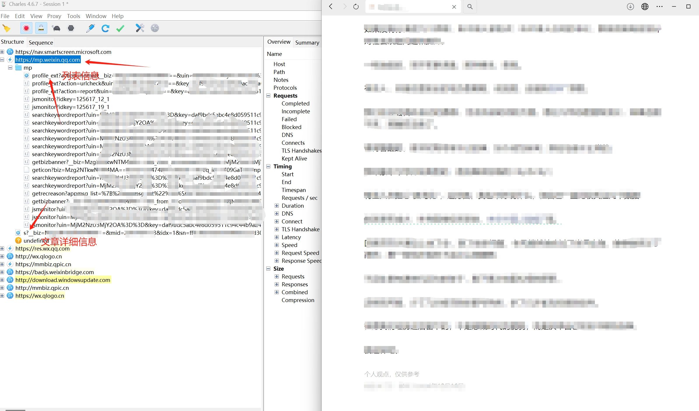
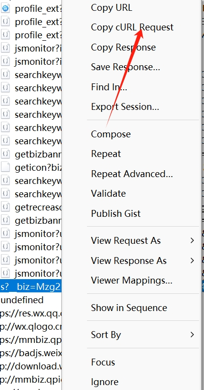
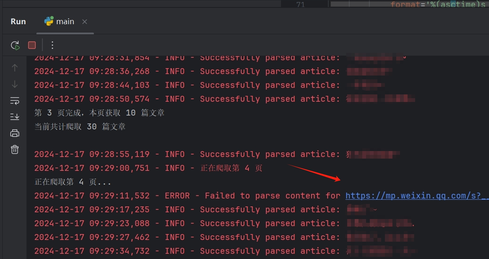
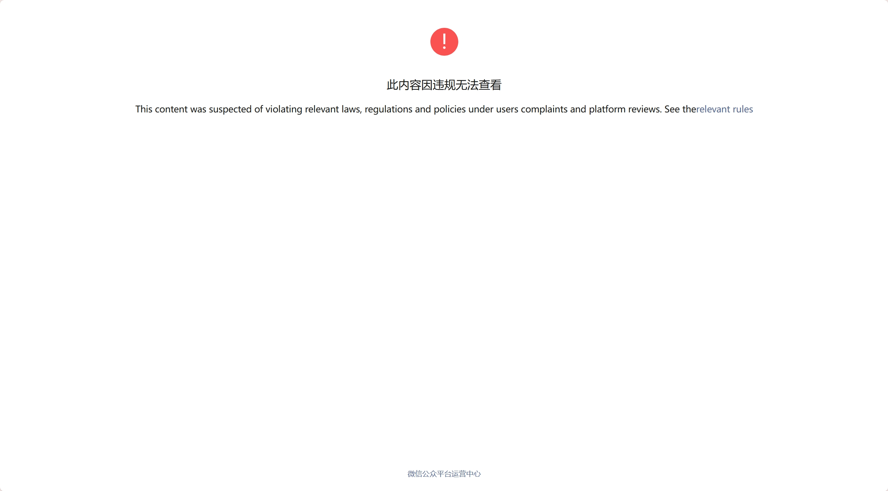

# WeChat Article Crawler

> 🚀 🚀 🚀 A crawler tool for fetching historical articles from WeChat public accounts, supporting Windows, Linux, and Mac platforms, and capable of stable and efficient extraction of large amounts of article data.

 

  
  

[简体中文](README.md) | [English](README-en.md)

## 1. Project Overview  
#### Features

- Bulk scraping of historical articles from WeChat public accounts  
- Support for extracting article content, authors, publication dates, and more  
- Offers multiple data storage formats (Excel, CSV, JSON)

#### Technology Stack

- Python 3.x  
- requests  
- BeautifulSoup4  
- pandas  
- logging  

## 2. Use Cases

- Archiving content from public accounts  
- Data analysis of articles  
- Content backup management  

## 3. Environment Setup  
- Python 3.7+  
- `pip install -r requirements.txt`

## 4. Configuration File Explanation (`config.txt`)  
- `iniCopyCOOKIE` - WeChat cookie information  
- `X_WECHAT_KEY` - WeChat key  
- `X_WECHAT_UIN` - User identifier  
- `EXPORTKEY` - Export key  
- `USER_AGENT` - Browser identifier  
- `PASS_TICKET` - Pass ticket  
- `BIZ` - Unique identifier for the public account  

## 5. Core Features  
- Configuration parameter retrieval and update  
- Support for reading configuration files  
- Automated parameter validation  
- Automatic configuration template generation  
- Article list scraping  
- Pagination for list retrieval  
- Automatic page navigation  
- Error retry mechanism  
- Content parsing of articles  
- Title extraction  
- Author information  
- Publication date  
- Geolocation data  

## 6. Usage Guide  

#### Screenshot  

#### 1. Download Packet Capture Tool  
Download [Charles](https://www.charlesproxy.com/latest-release/download.do)

#### 2. Open Packet Capture Tool  

##### Process  

1. **Open WeChat public account article**  
   

2. **Capture link**  
   As shown:  
   

3. **Copy curl to extract key information**  
   

4. **Running Issues**  

Sometimes issues occur, mostly due to content being controlled. Simply ignore such cases as shown below:  

