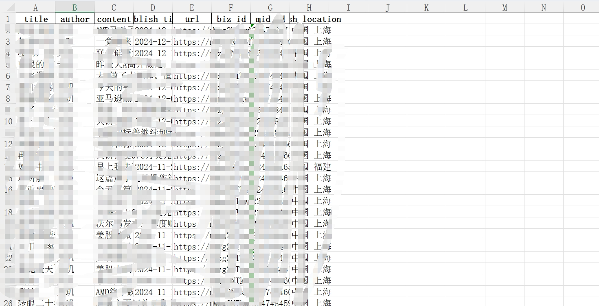
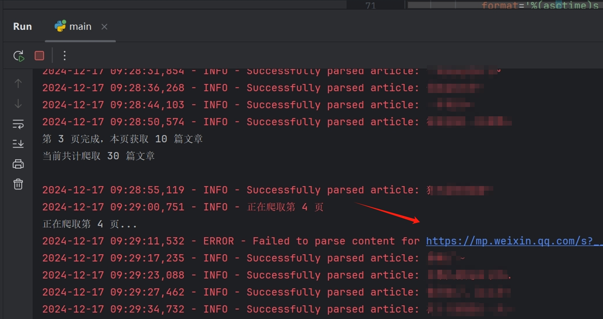
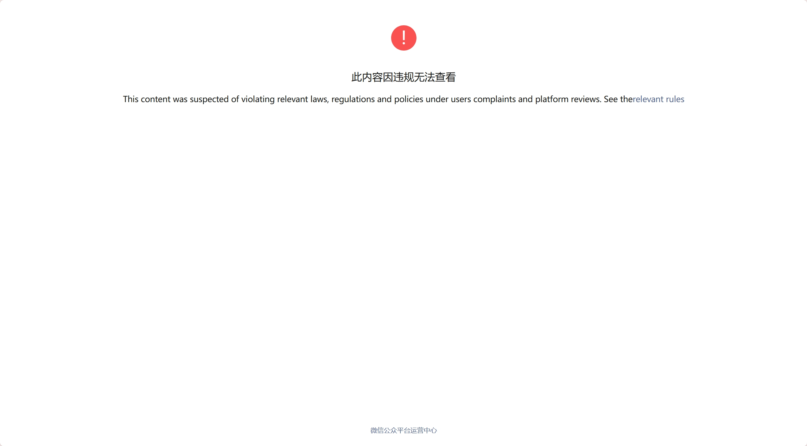

# WeChat Article Crawler


> 🚀 🚀 🚀 一个用于抓取公众号历史文章的爬虫工具，支持Windows、Linux、Mac平台，可以稳定抓取大量文章数据。

<br>

 
 


[简体中文](README.md) | [English](README-en.md)


## 1. 项目简介
#### 功能概述

- 微信公众号历史文章批量抓取
- 支持文章内容、作者、发布时间等信息获取
- 提供多种数据存储格式(Excel、CSV、JSON)

#### 技术栈

- Python 3.x
- requests
- BeautifulSoup4
- pandas
- logging

## 2. 适用场景

- 公众号内容存档
- 文章数据分析
- 内容备份管理

## 3. 环境准备
- Python 3.7+
- pip install -r requirements.txt
## 4. 配置文件说明（config.txt）
- iniCopyCOOKIE=微信Cookie信息
- X_WECHAT_KEY=微信密钥
- X_WECHAT_UIN=用户识别码
- EXPORTKEY=导出密钥
- USER_AGENT=浏览器标识
- PASS_TICKET=通行证
- BIZ=公众号唯一标识
## 5. 核心功能
- 配置参数获取与更新
- 支持配置文件读取
- 参数自动化验证
- 配置模板自动生成
- 文章列表抓取
- 分页获取列表
- 自动翻页
- 错误重试
- 文章内容解析
- 标题提取
- 作者信息
- 发布时间
- 位置信息

## 6. 使用指南
#### 效果图


#### 1. 抓包工具下载  
下载 [Charles](https://www.charlesproxy.com/latest-release/download.do)

关于用法这里不过多赘述，直接引用这篇教程:
https://blog.csdn.net/m0_72210949/article/details/131146091


#### 2. 打开抓包工具进行抓包  

##### 流程  

1. **打开微信的公众号文章**  
   

2. **抓取链接**  
   如图所示：  
   

3. **复制 curl 提取关键信息**  
     

   **说明**：  
   现在的 AI 工具非常强大，这里不再详细说明信息是如何对应的，你可以直接使用以下提示词进行操作：  

   ```bash
   根据 curl 更换过期的信息，你必须严格按照原来的格式替换。请注意：  
   - 第一个 pass_ticket 的值为 PASS_TICKET。  
   - 第二个 pass_ticket 在 COOKIE 中。  
   替换为 config.txt 以及 curl 的真实内容。
   ```

4. **运行问题**

有时候会出现问题，多半就是内容被管控了，直接忽略就好，打开以后就是管控的效果





